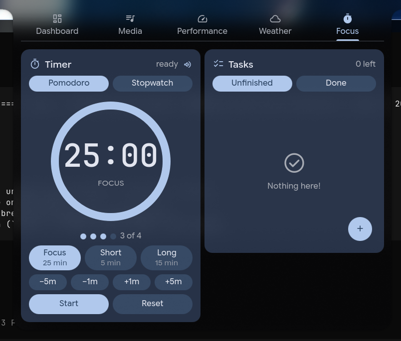
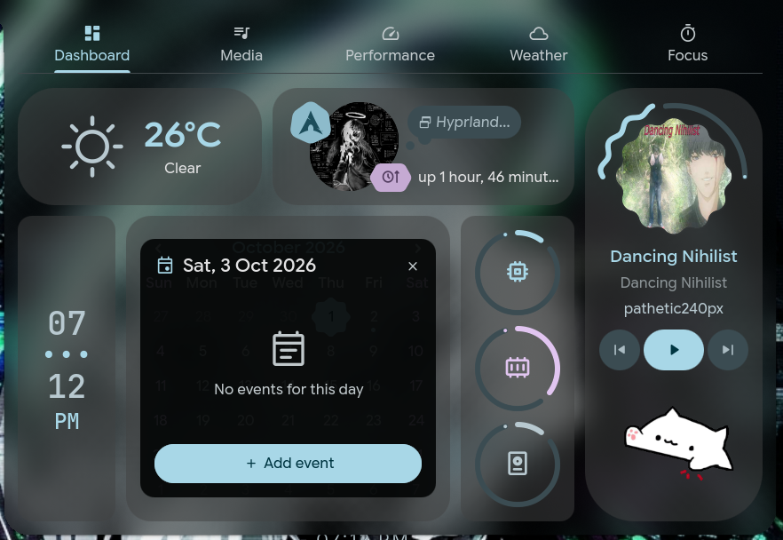
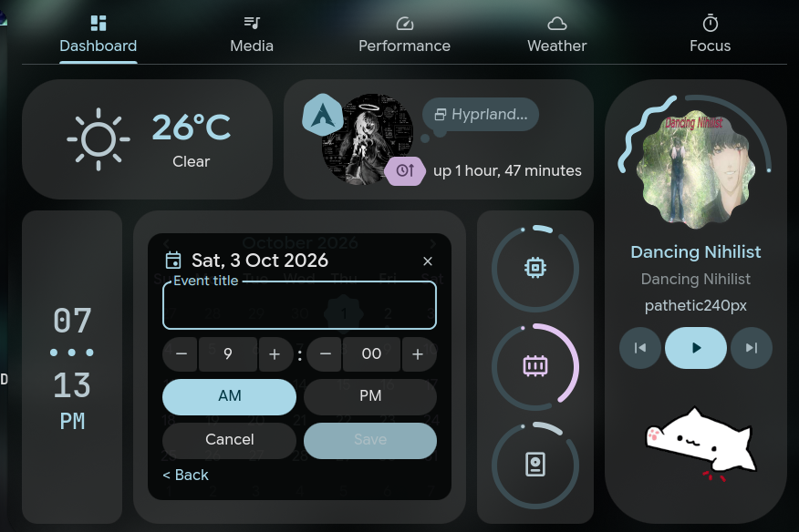
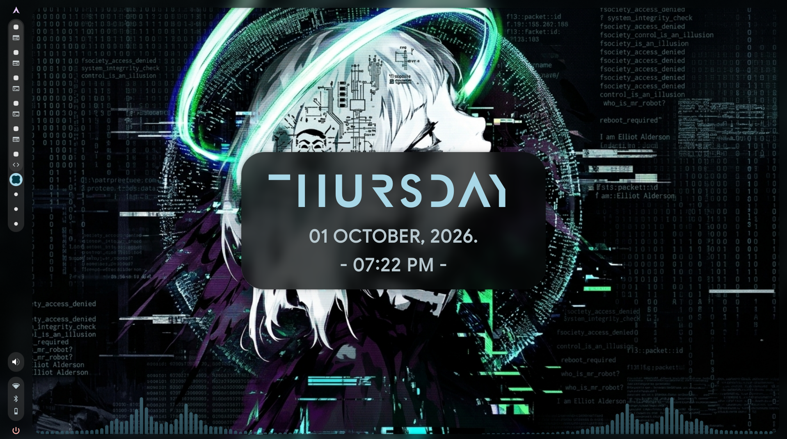

# caelestia-shell-customX

Custom widgets for the out-of-the-box [Caelestia Shell](https://github.com/caelestia-dots/shell)
(Quickshell, Hyprland): a Pomodoro timer card and a to-do list card living
together in a new **Focus** dashboard tab.



## Features

- **Timer card** — pomodoro modes (Focus 25 / Short 5 / Long 15) with session
  dots and 4-cycle tracking, urgency ramp (primary → tertiary → error),
  custom ±1/±5 min adjust, Start/Pause/Resume + Reset, completion chime
  (`complete.oga` via `paplay`) with persisted mute toggle, **Stopwatch**
  tab with laps.
- **Tasks card** — Unfinished/Done tabs, FAB + add dialog (Enter/Esc),
  per-task check + delete, Clear completed, JSON persistence.
- **Calendar events** — dot markers on days with events, click a date to
  open a two-phase dialog: event list (with empty state and an
  **Add event** button) and an add form with 12-hour steppers (hour 1–12,
  minute step 5 with wrap-around carry) + AM/PM toggle, check-off and
  delete per event. Today and future dates only, local `events.json`
  persistence.

  
  
- **Desktop clock** — minimalist day / date / `- time -` restyle of the
  upstream desktop clock (existing scale, background/blur/shadow and
  12h/24h settings still apply). The day name uses Lincoln Electric Over
  (commercial, Canada Type): install the OTF into `~/.local/share/fonts`
  and the installer verifies it via `fc-list`. Date and time use the
  readable UI font from your shell config.


- **App-lifetime services** — `TimerService` / `TodoService` /
  `EventService` singletons keep
  ticking and notifying with the dashboard closed; state resumes from
  wall-clock time after a shell restart.
- **Native look** — Caelestia M3 tokens only (`Colours`, `Tokens`,
  `StyledRect` family), no custom theme to maintain.

## Requirements

| Need | Check | Arch example |
|---|---|---|
| Quickshell + caelestia-shell | `qs --version`, `caelestia --version` | AUR `caelestia-shell-git` |
| Hyprland (Wayland) | `hyprctl version` | `hyprland` |
| Notifications | `command -v notify-send` | `libnotify` |
| Alarm sound | `command -v paplay` | `pipewire` / `pipewire-pulse` |
| Fonts | Material Symbols, CaskaydiaCove | `ttf-material-symbols-variable-git`, `ttc-caskaydia-cove` |
| Python 3 (installer patches only) | `python3 --version` | `python` |

Tested against the caelestia-shell snapshot shipping in
`/etc/xdg/quickshell/caelestia` — see [Compatibility](#compatibility).

## Install

```bash
git clone https://github.com/vemaarnandha/CCSx.git caelestia-shell-customX
cd caelestia-shell-customX
./install.sh
```

Preview without changing anything:

```bash
DRY_RUN=1 ./install.sh
```

The installer backs up `~/.config/quickshell` (timestamped, keeps 3),
creates the user shadow copy of the system shell (so upstream updates
never overwrite your widgets), overlays the custom modules, applies
minimal upstream patches (Focus tab entry, dashboard keyboard focus,
calendar event dot + click + popover),
verifies, and reloads the shell. Re-running is safe (idempotent).

## Usage

- Hover top-center → dashboard → **Focus** tab.
- Timer: pick a mode chip (or adjust ±min), Start. Ring, dots and counter
  track the pomodoro cycle; breaks are suggested automatically.
- Stopwatch tab: Start/Pause, Lap, Reset. Laps and elapsed time persist.
- Tasks: `+` FAB or type + Enter, Unfinished/Done tabs, click to
  check/uncheck, hover for delete. Speaker icon mutes the timer chime.
- Calendar: hover top-center → dashboard → click a date to see its
  events; days with events show a dot. **Add event** opens the form:
  type a title, set the hour/minute steppers (59 ▲ carries +1 hour)
  and AM/PM, then Save. Past dates are view-only.
- The timer keeps running and notifies with the dashboard closed
  (the shell process itself must be running).

## Uninstall

```bash
./uninstall.sh            # removes widgets, restores patched files
./uninstall.sh --purge-data  # also deletes todos.json / timer.json / events.json
```

## Known limitations

- Exact on-time notification requires the shell process to be alive;
  expiries during downtime are reported on next open (within 5 minutes),
  older ones are marked done silently.
- Stopwatch restores paused after a shell restart by design.
- `qmllint` cannot validate these files (missing Caelestia plugin types);
  validation is runtime + shell log.
- Dashboard text input needs the `ContentWindow.qml` keyboard-focus patch
  (applied by the installer).

## Compatibility

If upstream `Content.qml` / `ContentWindow.qml` / `Calendar.qml` drift, `install.sh` prints
`WARN: anchor not found` and skips that patch instead of corrupting files.
Check `CHANGELOG.md` for the tested snapshot per release.

## Credits

- [Caelestia Dots shell](https://github.com/caelestia-dots/shell) — the base.
- [end-4/dots-hyprland](https://github.com/end-4/dots-hyprland) (GPL-3.0) —
  service-owned-list pattern (`Todo`), 3-state button label, cycle badge
  and stopwatch UX inspiration.

## License

GPL-3.0 — see [LICENSE](LICENSE). Bug reports and PRs welcome via GitHub
issues; include your caelestia-shell version and the relevant shell log.
